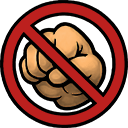

# Spelunky 2 - Stop Hitting Each Other

The "Stop Hitting Each Other" mod disables friendly fire and self-damage for players. Weapons, guns, thrown objects, or ricochets will no longer hurt other players or yourself. You can optionally extend this protection to pets and tamed mounts via configurable settings.

## Features
- Prevents players from dealing damage to each other (friendly fire disabled)
- Prevents self-damage (you cannot hurt yourself via your own weapons or thrown items)
- Configurable options:
  - Players can't hurt pets (default: true)
  - Players can't hurt tamed mounts (default: true)

### Planned:
- **Online multiplayer support** (compatibility untested, let me know if it works)

## Changelog

### 1.0
- **Added:**
  - Friendly fire and self damage blocking system
  - Configuration options for pets and mounts

## Contributions
I welcome feedback, bug reports, and feature ideas!